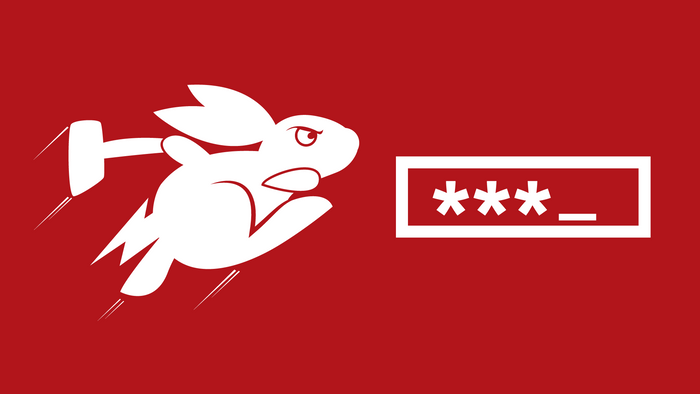
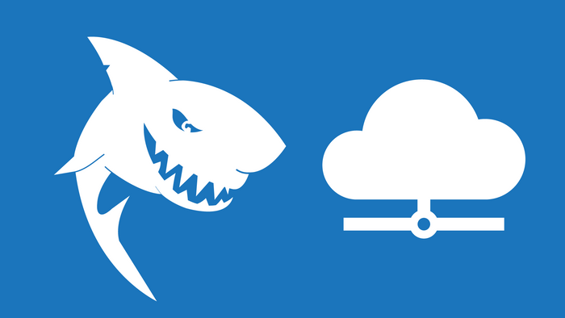

# hak5-submissions

- ...
- ...
- ...

## Description

...

## Payloads

### Bash Bunny

#### Credentials

["Microsoft Windows" Problem Steps Recorder](./bashbunny-payloads/credentials/win_problemstepsrecorder/)

["Microsoft Windows" SSLKEYLOG](./bashbunny-payloads/credentials/win_sslkeylog/)

#### Execution

[Get System Account](./bashbunny-payloads/execution/Get-System/)

[PwnKit Vulnerability - Local Privilege Escalation](./bashbunny-payloads/execution/PwnKit_LPE/)

[PwnKit Vulnerability - Local Privilege Escalation - Compiled](./bashbunny-payloads/execution/PwnKit_LPE_Compiled/)

#### Exfiltration

[Files Exfiltration with "SanDisk Wireless Stick"](./bashbunny-payloads/exfiltration/SanDisk-Wireless-Stick_Exfiltration/)

#### Phishing

[Fake sudo](./bashbunny-payloads/phishing/fake-sudo/)

["Microsoft Windows 10" Fake Logon Screen](./bashbunny-payloads/phishing/windows10_fakelogonscreen/)

["Microsoft Windows" Browser in the Browser (BitB)](./bashbunny-payloads/phishing/windows_browser-in-the-browser/)

#### Remote Access

["Microsoft Windows" SMB Backdoor](./bashbunny-payloads/remote_access/win_smb-backdoor/)

["Microsoft Windows" WinRM Backdoor](./bashbunny-payloads/remote_access/win_winrm-backdoor/)

### Key Croc

#### Recon

[nmap_recon](./keycroc-payloads/recon/nmap_recon/)

[wireless_recon](./keycroc-payloads/recon/wireless_recon/)

### O.MG

#### Remote Access

[win_smb-backdoor](./omg-payloads/remote_access/win_smb-backdoor/)

### Shark Jack

#### Remote Access

[On-Site%20Implant](./sharkjack-payloads/remote_access/On-Site%20Implant/)

### USB Rubber Ducky

#### Remote Access

[win_winrm-backdoor](./usbrubberducky-payloads/remote_access/win_winrm-backdoor/)
